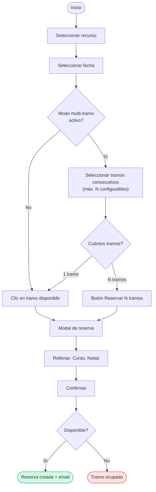
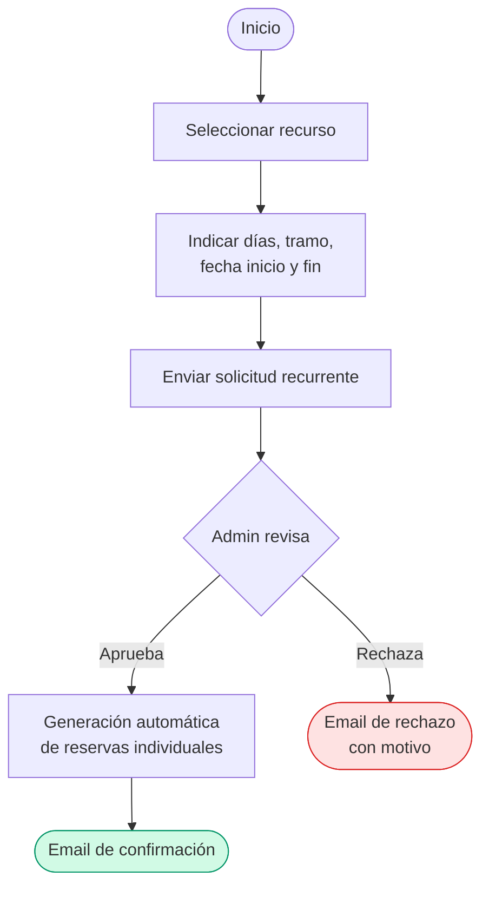

# Sistema de Reservas de Recursos y Salas

> Sistema web para gestionar la reserva de aulas, laboratorios, equipos y otros recursos compartidos en centros educativos. Funciona íntegramente sobre infraestructura de Google (Apps Script + Sheets), sin necesidad de servidor propio.

---

## Para quién es este proyecto

Si tu centro educativo tiene **espacios compartidos** (laboratorios, salas de informática, aulas polivalentes) y **equipos móviles** (carros de portátiles, kits de robótica, equipos de grabación) que se reparten entre profesores y grupos, este sistema te permite gestionarlo todo desde una aplicación web integrada con Google Workspace.

Concretamente, resuelve situaciones habituales como:

- Múltiples profesores necesitan reservar las **mismas salas o equipos** y no existe un sistema centralizado.
- Se necesitan **reservas recurrentes** (p. ej. "todos los lunes de 10:00 a 11:00") con un flujo de aprobación por parte del administrador.
- Hay que **reportar incidencias** sobre el estado de los recursos (averías, limpieza, mantenimiento).
- El centro trabaja con **Google Workspace** y se busca una solución sin infraestructura adicional.

> Los nombres de espacios, equipos y franjas horarias se configuran íntegramente desde el panel de administración, sin tocar el codi.

---

## Funcionalidades principales

- **Reservas por franjas horarias** con control de disponibilidad en tiempo real
- **Multi-tramo**: reserva de hasta N tramos consecutivos en un solo paso (N configurable por el administrador)
- **Reservas recurrentes**: solicitud, aprobación/rechazo por el admin, generación automática de reservas individuales y edición de tramos concretos
- **Panel de administración** completo: gestión de recursos, tramos, disponibilidad, usuarios, cursos e incidencias sin tocar el código
- **Sistema de incidencias** para reportar problemas con recursos (categorías, prioridad, seguimiento)
- **Notificaciones por correo** al usuario y copia opcional al administrador (confirmación, cancelación, aprobación de recurrentes)
- **Control de acceso** vía Google Workspace SSO (sin gestión de contraseñas)
- **Diseño adaptativo** — funciona en móvil, tableta y escritorio

---

## Cómo funciona: el proceso de reserva

### Flujo de reserva individual

### Flujo de reserva recurrente

---

## Arquitectura técnica

El sistema funciona íntegramente sobre infraestructura de Google: no requiere servidor propio ni base de datos externa.

| Capa          | Tecnología                                     |
|---------------|-------------------------------------------------|
| Backend       | Google Apps Script (JavaScript V8)              |
| Base de datos | Google Sheets                                   |
| Autenticación | Google Workspace SSO                            |
| Frontend      | HTML + JavaScript vanilla + Tailwind CSS        |

### Ficheros principales

**Backend (`.gs`)**

| Fichero                    | Función                                                              |
|----------------------------|----------------------------------------------------------------------|
| `Codigo.gs`                | Motor principal: disponibilidad, CRUD reservas, autenticación, caché |
| `AdminFunctions.gs`        | Funciones de administración: CRUD recursos, tramos, usuarios, cursos |
| `ReservasRecurrentes.gs`   | Motor de reservas recurrentes: solicitudes, aprobación, generación   |
| `Incidencias.gs`           | Sistema de incidencias                                               |
| `Setup.gs`                 | Asistente de instalación inicial                                     |

**Frontend (`.html`)**

| Fichero              | Función                                                        |
|----------------------|----------------------------------------------------------------|
| `index.html`         | UI principal del usuario                                       |
| `admin-panel.html`   | Panel de administración (pestañas)                             |
| `scripts.html`       | JavaScript de la interfaz de usuario                           |
| `admin-scripts.html` | JavaScript del panel de administración                         |
| `styles.html`        | Estilos CSS compartidos                                        |
| `ActivacionSistema.html` | Asistente de primer uso                                    |

---

## Instalación

### Requisitos previos

- Una cuenta de **Google Workspace** (del centro educativo)
- Acceso al **editor de Google Apps Script** ([script.google.com](https://script.google.com/))

### Pasos

1. **Crear un proyecto en Google Apps Script**
   - Ve a [script.google.com](https://script.google.com/) y crea un nuevo proyecto.
   - Copia todos los ficheros `.gs` y `.html` de este repositorio en el proyecto.

2. **Desplegar como aplicación web**
   - En el editor de Apps Script, ve a **Desplegar > Nueva implementación**.
   - Tipo: **Aplicación web**.
   - Ejecutar como: **Usuario que implementa**.
   - Acceso: **Cualquier usuario del dominio** (o según las necesidades del centro).

3. **Inicializar el sistema**
   - Abre la URL generada del despliegue.
   - Haz clic en **"Inicializar Sistema"**.
   - El sistema creará automáticamente:
     - 9 hojas en Google Sheets (Recursos, Tramos, Disponibilidad, Reservas, Usuarios, Cursos, Config, Incidencias, SolicitudesRecurrentes)
     - Datos de ejemplo (2 recursos, 5 tramos horarios, 1 curso)
     - Tu usuario como administrador

4. **Configurar**
   - Accede al **Panel de Administración** desde la aplicación.
   - Configura recursos, tramos horarios, disponibilidad, cursos y usuarios.

---

## Configuración

Todas las opciones se gestionan desde la pestaña **Configuración** del panel de administración:

| Clave                           | Descripción                                              | Valor por defecto |
|---------------------------------|----------------------------------------------------------|-------------------|
| `dias_vista_maximo`             | Días máximos en el futuro para reservar                  | 30                |
| `minutos_antelacion`            | Antelación mínima para reservar (minutos)                | 60                |
| `limite_reservas`               | Máximo de reservas activas por usuario                   | 10                |
| `horas_cancelacion`             | Horas mínimas de antelación para cancelar                | 24                |
| `exigir_motivo`                 | Exigir motivo en cada reserva                            | false             |
| `modo_mantenimiento`            | Pausar el sistema de reservas                            | false             |
| `permitir_multitramo`           | Permitir reservar varios tramos consecutivos             | false             |
| `max_tramos_simultaneos`        | Máximo de tramos consecutivos por reserva                | 2                 |
| `admin_recibir_copia_reservas`  | Enviar copia de confirmaciones al admin                  | false             |
| `email_admin`                   | Email del administrador para notificaciones              | —                 |
| `nombre_centro`                 | Nombre del centro educativo                              | —                 |
| `url_logo`                      | URL del logotipo del centro                              | —                 |

---

## Base de datos (Google Sheets)

El sistema crea y gestiona automáticamente 9 hojas:

| Hoja                      | Contenido                                                  |
|---------------------------|------------------------------------------------------------|
| **Recursos**              | Salas y equipos: nombre, tipo, icono, ubicación, capacidad |
| **Tramos**                | Franjas horarias: nombre, hora inicio, hora fin            |
| **Disponibilidad**        | Qué recursos están disponibles en qué días y tramos        |
| **Reservas**              | Todas las reservas individuales                            |
| **Usuarios**              | Cuentas de usuario, permisos y especialidad                |
| **Cursos**                | Grupos educativos y niveles                                |
| **Config**                | Parámetros de configuración del sistema                    |
| **Incidencias**           | Reportes de problemas con recursos                         |
| **SolicitudesRecurrentes**| Solicitudes de reservas periódicas                         |

---

## Reportar problemas

Si detectas errores o tienes sugerencias de mejora, abre un **issue** en este repositorio con una descripción clara y, si es posible, capturas de pantalla.

---

## Licencia

Este proyecto se distribuye bajo **CC BY-NC-SA 4.0**.

Consulta los términos completos en: https://creativecommons.org/licenses/by-nc-sa/4.0/

---

*Desarrollado con IA, libre para toda la comunidad educativa*
